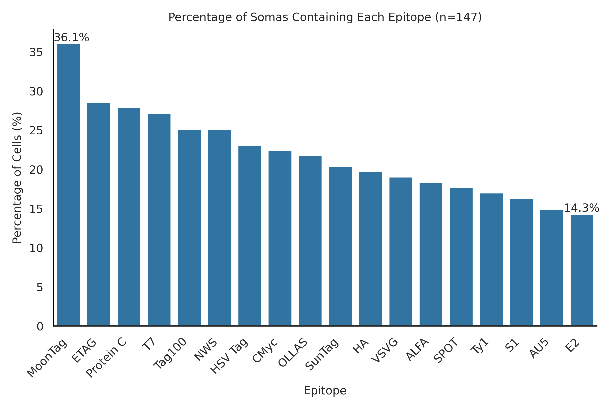

# Epitope Distribution Analysis

## Overview
This plot shows the distribution of epitopes across 147 somas in the barcode analysis, sorted in descending order.

## Details
- **Total somas analyzed**: 147
- **Highest epitope presence**: 36.1%
- **Lowest epitope presence**: 14.3%

The histogram showcases the distribution of each epitope of the barcode, indicating the percentage of cells containing each epitope.

